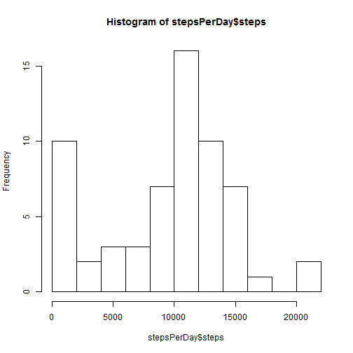
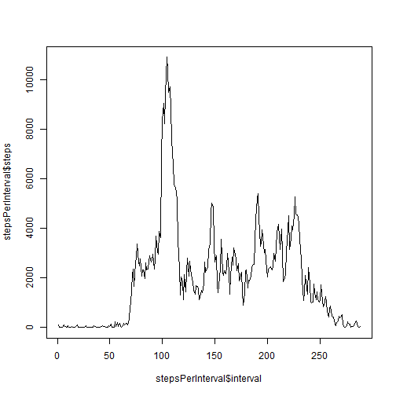
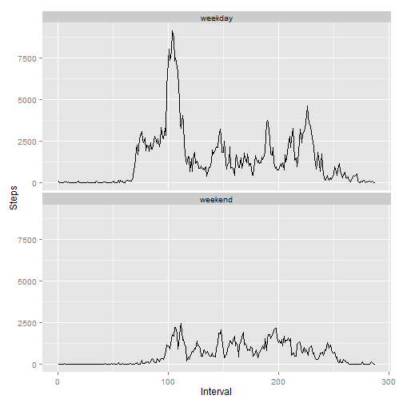

# Reproducible Research: Peer Assessment 1


## Loading and preprocessing the data
First we need to read the data to the "data" variable.


```r
data <- read.csv("activity.csv")
```
Next we create some auxilary data variables:
- days:

```r
Sys.setlocale(category = "LC_TIME", locale = "C")
days <- strptime(as.character(data$date), format='%Y-%m-%d')
days <- as.factor(ifelse((weekdays(days)=="Sunday")|(weekdays(days)=="Saturday"),
                "weekend", "weekday"))
```
- number of steps taken each day:

```r
stepsPerDay <- aggregate(data$steps, list(data$date), sum, na.rm = TRUE)
names(stepsPerDay) <-c ("date", "steps")
```
- overall number of steps taken each time interval:

```r
stepsPerInterval <- aggregate(data$steps, list(as.factor(data$interval)), sum, na.rm = TRUE)
names(stepsPerInterval) <-c ("interval", "steps")
stepsPerInterval$interval <- as.numeric(stepsPerInterval$interval)
```
- overall number of steps taken each time interval on weekdays and weekends:

```r
steps <- aggregate(data$steps, list(as.factor(data$interval), days), sum, na.rm = TRUE)
names(steps) <-c ("Interval", "Weekday", "Steps")
steps$Interval <- as.numeric(steps$Interval)
```

## What is mean total number of steps taken per day?

We can make a histogram of the total number of steps taken each day:


```r
hist(stepsPerDay$steps, 10)
```

 

We also can determine some general statistical characteristics:

```r
summary(stepsPerDay$steps)
```

```
##    Min. 1st Qu.  Median    Mean 3rd Qu.    Max. 
##       0    6780   10400    9350   12800   21200
```

So, mean total number of steps is 9354.2295 and median is 10395.

## What is the average daily activity pattern?

We make a time series plot to  figure out the average daily activity pattern:


```r
plot(stepsPerInterval$interval, stepsPerInterval$steps, type = "l")
```

 

To get the time interval with maximum activity we can call

```r
stepsPerInterval$interval[stepsPerInterval$steps == max(stepsPerInterval$steps)]
```

```
## [1] 104
```

## Imputing missing values

There are some NA values in data set:

```r
sum(is.na(data$steps))
```

```
## [1] 2304
```

We can approximate them as mean number of steps taken this day:

```r
nas<-is.na(data$steps)
data$steps[nas == TRUE]<-stepsPerDay$steps[data$date[nas == TRUE]] / nrow(stepsPerInterval)
```

Now we can recalculate histogramm of the total number of steps taken each day and find mean and median:


```r
stepsPerInterval <- aggregate(data$steps, list(as.factor(data$interval)), sum)
names(stepsPerInterval) <-c ("interval", "steps")
stepsPerInterval$interval <- as.numeric(stepsPerInterval$interval)

hist(stepsPerDay$steps, 10)
```

 

```r
mean(stepsPerDay$steps)
```

```
## [1] 9354
```

```r
median(stepsPerDay$steps)
```

```
## [1] 10395
```
It seems that these values do not differ from the estimates from the first part of the assignment. 

## Are there differences in activity patterns between weekdays and weekends?

There is some difference in activity patterns between weekdays and weekends:

```r
library(ggplot2)
plot<-ggplot(data = steps, aes(x = Interval, y = Steps))
plot<-plot + geom_line(aes(group = Weekday))
plot<-plot + facet_wrap(~ Weekday, nrow = 2, ncol = 1)
print(plot)
```

 
